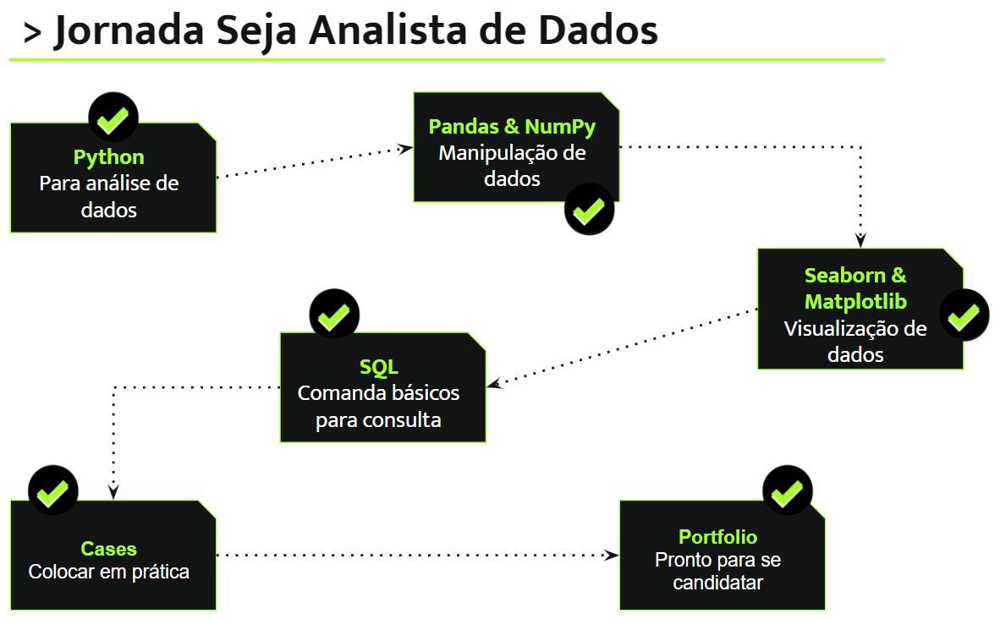

# JORNADA SEJA ANALISTA DE DADOS
Jornada para se tornar analista de dados

 

## __NOSSAS REDE SOCIAIS__

 

## __JORNADA__

## __VÍDEOS DA JORNADA__

### __MÓDULO 1__

1. [Jornada Seja Analista de Dados](https://youtu.be/uf9muMGGdN8)
2. [Configurando o ambiente](https://youtu.be/ecR-bQrNKJ8)
3. [Variáveis](https://youtu.be/AZucLNV47ts)
4. [Operadores Matemáticos](https://youtu.be/CJqCp0uGEp4)
5. [Estrutura de Dados](https://youtu.be/ofx0nLj_cp8)
6. [Operadores Lógicos, Comparação e Condição](https://youtu.be/XDZIl7mlKxw)
7. [Operadores de Repetição](https://youtu.be/ElFPRv15Tcc)
8. [2 Operadores de Repetição](https://youtu.be/KogVsS9xT7c)
9. [Funções](https://youtu.be/aSNk5K3QogE)

### __MÓDULO 2_

1. [Apresentação do Case](https://youtu.be/iKGCUmhPto8)
2. [Leitura de Arquivo de Dados com Pandas](https://youtu.be/SRJT5m3MLFQ)
3. [Conhecendo Nossos Dados](https://youtu.be/d1qII8TRyDM)
4. [Adicionando e Calculando Valores](https://youtu.be/wMWAjaJdSNg)
5. [Mergeando Dataframes](https://youtu.be/mQPC0n_6ibw)
6. [Agrupando e Pivotando Dados](https://youtu.be/nLiPq1irxuw)
7. [Filtrando o Dataframe](https://youtu.be/EVzB2N2Efc0)
8. [Exportando Dados](https://youtu.be/CrDhT0j_XgM)

